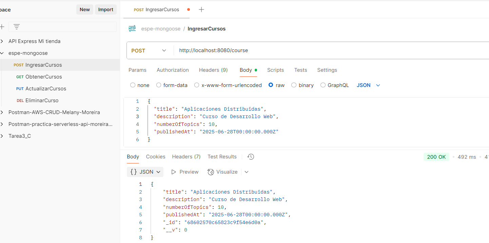
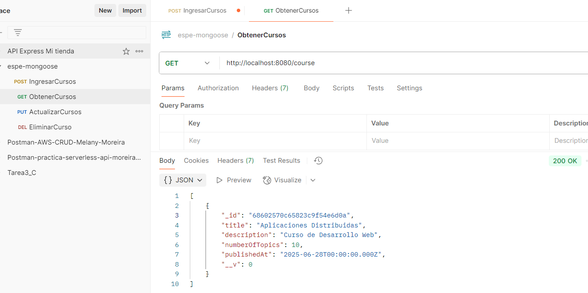
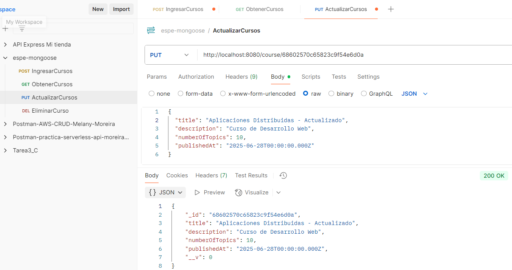
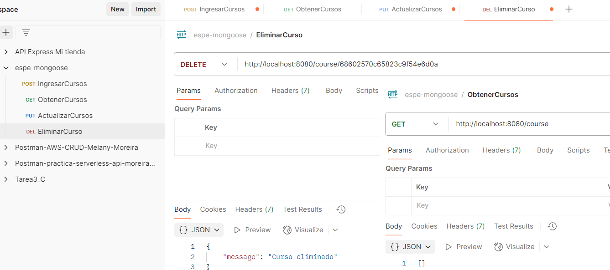
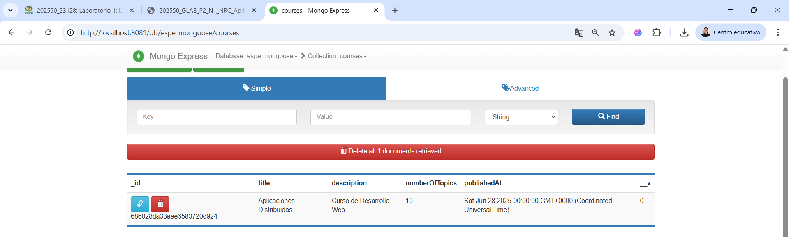

| **DEPARTAMENTO:** Ciencias de la Computación | **CARRERA:** Ingeniería en Tecnologías de la Información |
|----------------------------------------------|----------------------------------------------------------|
| **ASIGNATURA:** Aplicaciones Distribuidas    | **NIVEL:** 7to           | **FECHA:** 28/06/2025     |
| **DOCENTE:** Ing. Paulo Galarza              | **PRÁCTICA N°:** 1       | **CALIFICACIÓN:**         |

**Repositorio GitHub:** [https://github.com/melanymoreira/espe-mongoose.git](https://github.com/melanymoreira/espe-mongoose.git)

# Implementación de una API RESTful con Node.js, Express y MongoDB usando Mongoose

**Nombre del estudiante:**  
Melany Rosmery Moreira Zambrano

---

## RESUMEN

En esta práctica se desarrolló un sistema de gestión de cursos mediante una API RESTful utilizando Node.js, Express y MongoDB, empleando el ORM Mongoose para la administración eficiente de los datos. El sistema permite crear, consultar, actualizar y eliminar cursos, facilitando la gestión académica. Se estructuró el proyecto siguiendo buenas prácticas de desarrollo, separando modelos, rutas y controladores para mejorar la mantenibilidad. Además, se utilizó Docker para desplegar la base de datos y mongo-express para su administración visual. Las pruebas de los endpoints se realizaron con Postman, comprobando la correcta funcionalidad del sistema. El uso de Mongoose simplificó la interacción con la base de datos, permitiendo validaciones y modelado de datos de manera sencilla. Se concluyó que el uso de un ORM aporta ventajas significativas frente a las consultas nativas, mejorando la productividad y la seguridad del desarrollo.

**Palabras Claves:** API REST, Mongoose, MongoDB

---

## 1. INTRODUCCIÓN

El objetivo de esta práctica fue implementar una API RESTful para la gestión de cursos, aplicando el uso de un ORM (Mongoose) para interactuar con MongoDB. Se enfatizó la importancia de la organización del código y el uso de herramientas modernas como Docker para el despliegue de servicios. La práctica permitió afianzar conocimientos sobre el desarrollo backend y el manejo disciplinado de recursos en el laboratorio.

---

## 2. OBJETIVO(S)

2.1 Desarrollar una API RESTful organizada y funcional utilizando Node.js, Express y MongoDB.  
2.2 Aplicar el uso de Mongoose como ORM para la gestión eficiente de datos.  
2.3 Desplegar servicios de base de datos y administración usando Docker.

---

## 3. MARCO TEÓRICO

Un ORM (Object Relational Mapping) como Mongoose permite mapear documentos de MongoDB a objetos de JavaScript, facilitando la validación, consulta y manipulación de datos. A diferencia de las consultas nativas, el ORM proporciona abstracción, validación automática y mayor seguridad, reduciendo la posibilidad de errores y mejorando la mantenibilidad del código.

---

## 4. DESCRIPCIÓN DEL PROCEDIMIENTO

- Se creó la estructura del proyecto separando modelos, rutas y controladores.
- Se configuró el archivo `.env` para manejar variables sensibles.
- Se implementó el archivo `docker-compose.yml` para levantar MongoDB y mongo-express.
- Se desarrollaron los endpoints CRUD para el recurso "curso".
- Se realizaron pruebas de los endpoints usando Postman.
- Se documentó el proceso y los resultados obtenidos.

---

## 5. ANÁLISIS DE RESULTADOS

Se logró implementar correctamente la API, verificando el funcionamiento de los endpoints mediante Postman. Los datos se almacenaron y consultaron exitosamente en MongoDB. El uso de Mongoose simplificó la validación y el modelado de los datos, permitiendo un desarrollo más ágil y seguro. Se observó que la estructura modular facilita la escalabilidad y el mantenimiento del proyecto.

---

## 6. GRÁFICOS O FOTOGRAFÍAS

A continuación, se presentan capturas de pantalla del funcionamiento del proyecto:

**Creación de un curso en Postman:**  

**Consulta de cursos en Postman:**  

**Actualizar cursos en Postman:**  

**Eliminar cursos en Postman:**  

**Interfaz de mongo-express:**  

---

## 7. DISCUSIÓN

El uso de Mongoose como ORM demostró ser ventajoso frente a las consultas nativas, ya que permite definir esquemas, realizar validaciones y manejar relaciones de manera sencilla. Además, la integración con Docker facilitó el despliegue y la administración de la base de datos. La estructura modular del proyecto contribuyó a una mejor organización y comprensión del código.

---

## 8. CONCLUSIONES

- El uso de un ORM como Mongoose agiliza el desarrollo y mejora la calidad del código.
- Docker simplifica la gestión de servicios y dependencias en el entorno de desarrollo.
- La organización modular del proyecto facilita su mantenimiento y escalabilidad.
- Las pruebas con Postman permitieron validar el correcto funcionamiento de la API.

---

## 9. BIBLIOGRAFÍA

- MongoDB, Inc. (2024). [MongoDB Manual](https://docs.mongodb.com/). Consulta: 28/06/2025.
- Express.js Foundation. (2024). [Express Documentation](https://expressjs.com/). Consulta: 28/06/2025.
- Automattic. (2024). [Mongoose Documentation](https://mongoosejs.com/docs/). Consulta: 28/06/2025.